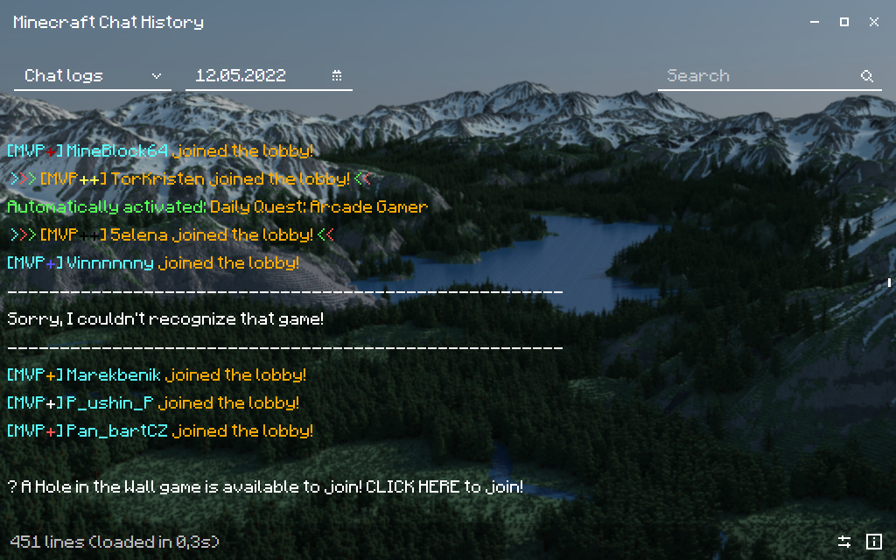

# Minecraft Chat History
View your Minecraft chat history with color and font formatting.




### What is Minecraft Chat History ?
Minecraft Chat History (MCCH) is an application that lets you view all of your Minecraft chat history. The app includes a nice formatting with the default color and font of Minecraft.

### How does this work ?
The Minecraft chat is continuously saved in log files while you are playing. These log files are compressed in *.gz* files, and can be found in the *logs* folder inside your *.minecraft* folder.
MCCH decompresses these files, read them and format them according to the Minecraft style, so the chat logs look nice and can be readable for you.
The logs are displayed by date, to make it more readable.

Please read the whole content of this page before installing MCCH.

---

## Installation
The app works on Windows and macOS. To install the app, read the steps below.

**Note:** There is no installer for macOS. The installer is only for Windows users.

### Installer (Windows only)
1. Download Java (you probably already have it installed if you play Minecraft).
2. Go to **Release** on the right side of this page.
3. Select the latest version.
4. Download the installer (```MCCHInstaller.exe```).
5. Execute the installer and follow the steps (you need an internet connection for this step).
6. The MCCH app shortcut should be in your **Start Menu** and on your **Desktop** on your computer. Done!
7. **Note:** MCCH and MCCS should be installed in the following directory:
    ```
         ../AppData/Roaming/MinecraftChatHistory
                    └ /MinecraftChatHistory/MCCH.jar
                    └ /MinecraftChatSearch/MCCS.jar
    ```
   
> [!WARNING]
> It is normal if Windows SmartScreen show a message saying "Windows protected your PC".
> It is because the installer requires administrator privileges to download the files, which Windows doesn't like.
> The installer contains no virus at all.


### Manual (Windows & macOS)
1. Download Java (you probably already have it installed if you play Minecraft).
2. Go to **Release** on the right side of this page.
3. Select the latest version.
4. Download the ```MinecraftChatHistory.zip``` ZIP file.
6. Extract it in the following folder on your computer:

   **Windows:**
   ```
         ../AppData/Roaming/MinecraftChatHistory
                    └ /MinecraftChatHistory/MCCH.jar
                    └ /MinecraftChatSearch/MCCS.jar
    ```
   **MacOS:**
    ```
         ../Library/Application Support/MinecraftChatHistory
                    └ /MinecraftChatHistory/MCCH.jar
                    └ /MinecraftChatSearch/MCCS.jar
    ```
7. Done! You can now create shortcuts to these files on your **Desktop**/**Start Menu**.
You can also use the upscaled icons in the ```icons``` folder above for your shortcut.

## Usage

### MCCH
When launching MCCH, today's chat logs will be displayed on the windows by default. To choose the date, either click on the calendar icon and select the date, or enter the date manually and press on ENTER.
You can also select the type of logs you want to display between "All", "Chat" or "Raw".

- **Chat:** displays every chat log with formatting and coloring. This is the type of log by default.
- **All:** displays every log line starting with a *[*, with formatting and coloring
- **Raw:** displays the entirety of the log content without formatting/coloring, in a raw format

Please note that the *Raw* and *All* log types takes longer to display because of the lack of filtering.

You can also search for a query in the currently displayed logs. Every line that contains the query will be highlighted in yellow.

> [!IMPORTANT]
> Make sure to select the correct path to your Minecraft log folder. On MCCH, click the settings button on the bottom right of the window, then check if the default path is correct, and change it if needed.

### MCCS
MCCS is an extremely powerful CLI (Command Line Interface) tool that is packaged with MCCH.
MCCS lets you search a query/content within all of your Minecraft logs. To launch this tool, either use the shortcut created with the installer or use the following command:
```java -jar [PATH_TO_MCCS]/MCCS.jar```.

Every command are explained extensively when launching MCCS. The main search command is ```search [query] [startDate] [endDate]```.

---

## FAQ

### Some chat logs are colored while some aren't. Why?
Some Minecraft servers don't use the traditional way of coloring chat text. Unfortunately, those color formats aren't saved with the logs, and thus can't be read and formatted by MCCH. Only the default color formats starting with *§* (ex: *§1*, *§a*) can be formatted by MCCH.

### The app keeps saying "No logs found for this date". Why?
There are four causes that can produce this :
1. The path to the log files is incorrect. Make sure the path leads to the minecraft logs folder. You can change it in the **Settings**.
2. There are no logs. If your logs folder is empty, the app won't be able to show anything!
3. The date is wrong. Make sure you didn't select the wrong year!
4. There are only internal logs, and no chat logs. Select **All logs** in the dropdown menu to see the internal logs.

### Where is the chat history located ?
Your chat history is saved in log files, which you can find in the *logs* folder inside your *.minecraft* folder. The logs are compressed in *.gz* files, which you have to decompress in order to view the logs. MCCH decompresses these files for you, and show the logs with a nice formatting!

### The app froze. Why?
If the app froze after you selected a date or a different log type, it can be due to the size of the files. If the log files for this date are huge, the app will spend a lot of time loading them, and sometimes, it fails due to memory usage being too high. So be patient, but if it takes more than a minute, close the app and restart it!

### The app won't launch. Why?
If you get an error saying "*A JNI error has occurred.*" upon launching the app, it's because you have an older version of Java installed on your computer. Make sure to check for Java update regularly on your computer.

---

## Disclaimer
MCCH relies on the log files' name to display the chat logs by date. **NEVER EVER CHANGE THE NAME OF YOUR LOG FILES. This could not only cause issues with MCCH, but also with Minecraft itself!**

MCCH **only reads** the log files and do not alter them in any way.


## Feedback
Do you want a feature to be added? Did you find a bug in the app? Head out to the **Issue** tab above, and suggest your feature/bug there! :)